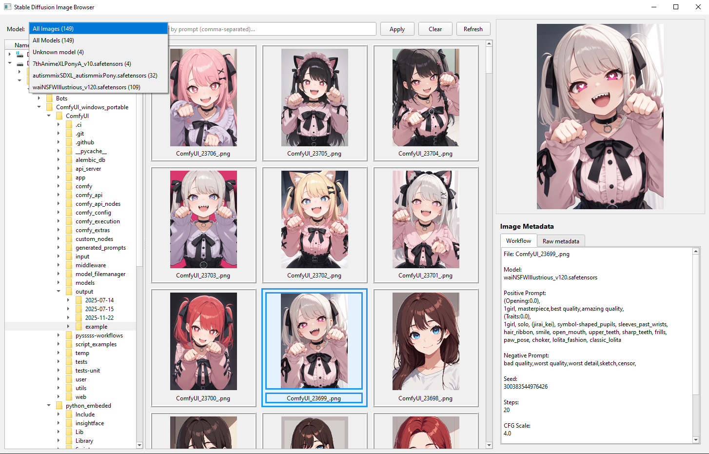

<div align="center">
  <h1> Stable Diffusion Image Browser </h1>


A desktop application for browsing metadata from Stable Diffusion generated images with prompt and model filtering.


</div>

## Features

### Image Display
- **Caching system**: For speedup on subsequent loads
- **Multi-Format Support**: PNG, JPG/JPEG, and WEBP files
- **Drag & Drop**: Drag images to other applications
- **Quick Open**: Double-click to open images in default viewer

### Metadata
- **Tabbed View**: "Workflow" (formatted) and "Raw metadata" (debug) tabs
- **Automatic Format Detection**: Supports multiple SD generators
  - Automatic1111 (A1111) - text format
  - CivitAI - text format with resources JSON
  - CivitAI Workflow - URN-based workflow format
  - ComfyUI - JSON workflow graphs
- **Complete Information**: Model, prompts, seed, steps, CFG, sampler, dimensions, LORAs

### Search
- **Model Filtering**: Dropdown with all detected models and image counts
- **Multi-Term Prompt Search**: Comma-separated search (e.g. `"black_hair, green_eyes"`)
- **Special Filters**:
  - All Images - show everything
  - All Models - only images with SD metadata
  - Unknown Model - images with prompts but no model name
  - Specific models - filter by model name

### Performance & Caching
- **Local Cache Directory**: `sd_cache/` folder in application directory
  - Metadata cache: `sd_cache/metadata_cache.json`
  - Thumbnail cache: `sd_cache/thumbnails/*.jpg`
- **Smart Cache Invalidation**: Automatically detects file changes
- **Progressive Loading**: Smooth streaming when cache is populated

## Quick Start

### Running from Source
```bash
# Install dependencies
pip install PyQt6'>=6.6.0' Pillow'>=10.0.0'

# Run application
python main.py
```

### Building Standalone Executable (Windows/Linux)

```bash
# Install dependencies
pip install pyinstaller'>=6.0.0' PyQt6'>=6.6.0' Pillow'>=10.0.0'

# Build application
pyinstaller sd_image_browser.spec --clean
```

Output (Windows): `dist/SD-Image-Browser.exe`

Output (Linux): `dist/SD-Image-Browser`

## Troubleshooting

**No images showing?**
- Check directory contains images
- Try "Refresh" button to rebuild cache

**No metadata displayed?**
- Check "Raw metadata" tab to see if any data is embedded
- Regular photos won't have SD metadata so it won't be parsed

**Slow loading?**

Well, it's not exactly C++ or the most optimal code, first scan of new directory would take some time to build cache.

## Contributing

Contributions welcome! Please feel free to submit a Pull Request.

## License

MIT License - see [LICENSE](LICENSE) file for details.
